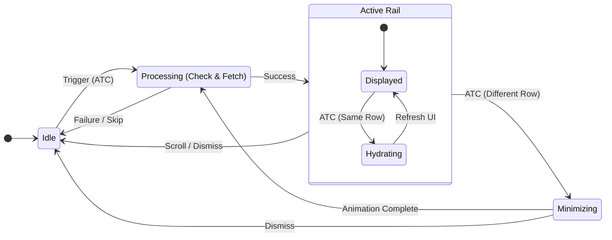

# PRD: Recommendation Rails

**Status**: Draft
**Area**: Consumer App (iOS/Flutter)
**Topic**: Recommendation Rails Logic (Cross-Platform)

## 1. Overview

### 1.1. Goal & Concept
The **Recommendation Rails** feature introduces dynamic, context-aware product suggestions triggered by user actions (specifically "Add to Cart"). Unlike static widgets which load with the page, these rails remain invisible until the user interacts with a product. At that moment, the system fetches and renders relevant cross-sell or up-sell items immediately within the user's view.

**Primary Objectives:**
*   **Basket Building**: Assist users in completing their mission by suggesting complementary items (e.g., "Bread" with "Milk").
*   **Cross-Selling**: Encourage discovery of related categories.
*   **Increase AOV**: Reduce friction for adding related items to grow the Average Order Value.

### 1.2. Key Metrics
*   **Conversion Rate**: Percentage of users who ATC from the recommendation rail.
*   **AOV Impact**: Lift in AOV for sessions where the rail was interacted with.
*   **Retention**: Long-term impact on user basket size and frequency.

---

## 2. User Experience

### 2.1. User Stories
1.  **Contextual Discovery**: As a user adding an item to my cart, I want to see immediate, relevant suggestions so I don't have to search for complementary products.
2.  **Non-Intrusive Flow**: As a user, I want recommendations to appear near my action (in focus) without jumping the page or losing my scroll position.
3.  **Performance**: As a user, I expect the app to remain responsive. Rapid ATCs should update existing recommendations (hydrate) rather than flashing new lists.

### 2.2. Interaction Design
The system employs a specific "Entrance Sequence" to ensure a smooth experience:

1.  **Trigger**: User taps "Add to Cart" (ATC).
2.  **Entrance (New Rail)**:
    *   **Draw**: The rail container expands **top-to-bottom** below the product row.
    *   **Focus**: The page smoothly scrolls to bring the new container into view.
    *   **Populate**: Product items animate in (e.g., slide-in from the right).
3.  **Hydration (Existing Rail)**:
    *   If a rail already exists at the same position (e.g., user increments count or clicks another item in the same row), the system **updates the content in place**.
    *   If the rail is partially out of view, the system smooth-scrolls to refocus it.
4.  **Exclusivity**: Only **one** recommendation rail exists at a time. Opening a new rail (different row) automatically closes any existing one.

---

## 3. Functional Requirements

### 3.1. Trigger Logic
The recommendation flow initiates *only* when:
1.  **Page is Eligible**: The current page configuration explicitly includes a `recommendation` widget.
    *   *Standard Pages (Home, PLP)*: Config is part of the page layout.
    *   *Search Results*: Config is derived from the **Search Page** "Empty State" layout.
2.  **Event is "Add to Cart"**: The user successfully adds an item.
3.  **Sampling Condition Met**: The global ATC count satisfies the `samplingCount` rule (`GlobalATC % samplingCount == 0`).
4.  **Not Self-Referential**: The trigger event did not originate from the recommendation rail itself.

### 3.2. Business Rules
*   **Sampling**: Acts as a quality gate. Limits exposure to prevent user fatigue and allow for A/B testing frequency. Resets on page reload.
*   **Positioning**: Always renders **immediately below** the product row where the ATC occurred.
*   **Hydration**: 
    *   **Same Row**: If the trigger comes from the *same* row (anchor index) as the active rail, **hydrate** (update content).
    *   **Different Row**: If the trigger comes from a *different* row, **replace** (close old, open new).

### 3.3. State Lifecycle


---

## 4. Technical Implementation

### 4.1. Architecture
The system uses a **Delegation Pattern** to separate configuration from rendering:
*   **Delegator**: Stores configuration (sampling, ID) and manages business logic (state machine, rules).
*   **Delegate**: UI component that handles the view state (Idle, Loading, Loaded) and animations.
*   **Data Layer**: identifying `type: recommendation` in page layouts and routing it to the Delegator instead of the visible widget list.

### 4.2. Configuration (Layout Response)
The specific widget configuration is delivered as part of the Page Layout but is **hidden** from the initial render.

```json
{
  "modules": [
    {
      "type": "recommendation",
      "id": "reco_widget_123",
      "samplingCount": 3,
      "configuration": {
        "strategy": "cross_sell",
        "title": "You might also like..."
      }
    }
  ]
}
```

### 4.3. API Specification

**Endpoint**: `POST /api/recommendation/product_recommendations/`

**Request**:
```json
{
  "store_id": 12345,
  "context": {
    "current_item_id": 9876,    // Trigger Product ID
    "cart_item_ids": [101, 102] // For exclusion
  },
  "widget_id": 123,             // From Layout Config
  "configuration": { ... }      // From Layout Config
}
```

**Response**:
Returns a list of products to be displayed in the rail.
```json
{
  "data": {
    "products": [
      { "product_id": 5555, "name": "Bread", ... },
      ...
    ]
  }
}
```

### 4.4. Integration Notes
*   **List Pages (Home, PLP)**: The Data Layer must filter out the recommendation widget and register it with the Delegator. The list adapter inserts the rail dynamically at `ClickedIndex + 1`.
*   **Search Page**: Must support **Hydration**. The Search UI observes the recommendation state and inserts a synthetic section into the search results list.

### 4.5. Constraints & Risks
*   **Animation Performance**: Top-down expansion and scroll-to-focus must be optimized to prevent frame drops, especially on older devices.
*   **Network Latency**: Determine timeout behavior. If the API is slow, should the rail appear late? (Current decision: Fail silently if threshold exceeded).
